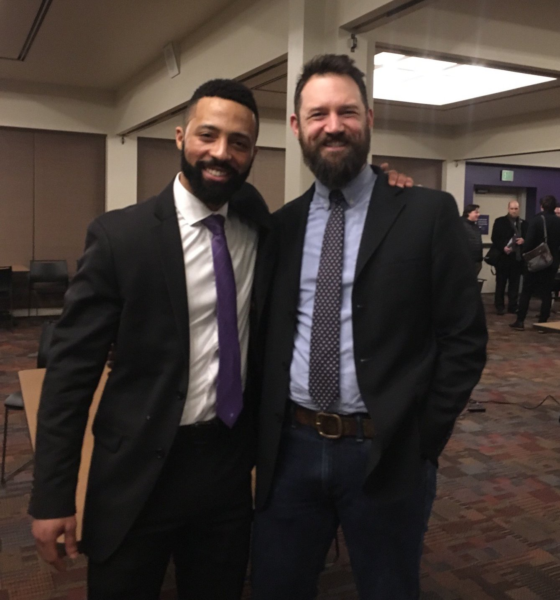

I don't think I'm breaking any new ground here by saying that the hardest part of any new effort is simply starting. It surely isn't the only thing, but it can be a big fret, and that's a small thing that holds people back from all kinds of opportunities. 

<a class="gallery-item right" href="../images/kh_van_chicago.jpg">Leaving Chicago</a>A couple years ago I chose to up-end myself from my home in Chicago to come to Seattle for practically nothing more than a change of scenery, and a refreshed take on where my career was heading. It wasn't exactly all according to a master plan, but it was a start.

As my move turned into somewhat of a sabbatical, I freed myself of some of the pressures and expectations that dog the job hunts and personal development goals. That step helped me dip my feet into some low-paying freelance design jobs, the kind I had avoided for many years. I didn't make a lot, but the practice revealed to me the value of my skills, and set into motion more opportunities I benefit from to this day. 

By and by I came to work at the University of Washington, running media technology at their Medical Research campus. I really like working for the University and giving support to some wicked smart research doctors and students who are doing critical research. But the role itself is dead-end, unchallenging, and poorly administrated. Definitely not the worst job I've ever had, but certainly leaving me wanting much more.

And that was the head space that lead me to jump at UW's first full stack code bootcamp. I had the time and the groundwork knowledge of some front-end technologies, but also a better bedrock of confidence in myself to take some leaps and start new things and experience growth regardless of the outcome. 

<a class="gallery-item left" href="../images/kh_and_arron.jpg">Me and my great teacher Arron</a>I completed the course in February, and pivoted immediately into a Teaching Assistant role with another cohort. Another start! Add on the necessary practices to find a developer job in Seattle's saturated market, I've leapt into revamping my portfolio, my website, and (lucky you!) a blog. More starts!

The gist I'm getting at isn't that I've arrived anywhere particular, or achieved any particular goal–I've plenty further to go–but that all the planning and dreaming in the world can't beat the pure power of just getting started with something new. It might be a spectacular failure. It might fizzle or fade. It might make you rich. But in any of those events, it will lead to a next thing, whether that's a job or a relationship or a new passion. 

<!--  -->